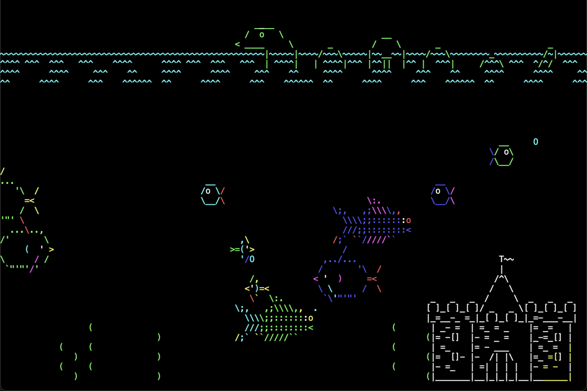

# Asciiquarium Redux 🐠

A joyful, colorful Python reimagining of the classic terminal aquarium. Watch fish swim, seaweed sway, hooks drop, sharks prowl, and bubbles pop—right in your terminal or a windowed Tk screen.

Original Asciiquarium by Kirk Baucom (Perl): [robobunny.com/projects/asciiquarium](https://robobunny.com/projects/asciiquarium/html/)

Status: Playable, configurable, and window-ready (Tk). Bring your own snacks (for the ducks).



## Why a Redux?

- Keep the whimsical aquarium alive on modern terminals and platforms
- Offer configurable FPS, colors, sizes, and deterministic playback (seeded RNG)
- Ship as an installable Python package for easy use (e.g., `pipx install`)

## Features

- Faithful animations: fish (with color masks), seaweed lifecycle/sway, waterline, castle, bubbles, and many specials (shark, whale, ship, ducks, swan, dolphins, monster, big fish)
- Fishhook gameplay: one hook at a time, impact pause, configurable dwell time, collisions while lowering/dwelling/retracting
- Smooth rendering: double-buffered terminal drawing to reduce flicker
- Backends: terminal (asciimatics) and windowed Tk canvas (resizable, color)
- Configurable everything: FPS, speed, density, spawn timings/weights, fish bands, colors; TOML-based config
- Deterministic playback (seed) for captures and demos

## Quick start

From source using uv (already configured in this repo):

```sh
# macOS/Linux
uv run python main.py  # terminal backend

# Or use the repo venv directly
source .venv/bin/activate
python main.py
```

Windowed Tk backend:

```sh
uv run python main.py --backend tk
```

Controls:

- q: quit
- p: pause/resume
- r: rebuild scene (useful after resize)
- h or ?: toggle help overlay
- space: drop/retract fishhook (random position in terminal)
- mouse: left-click to drop a hook at the cursor (or retract if one is active)
- s (Tk): save a screenshot as ./asciiquarium_#.png (auto-incrementing)

CLI examples:

```sh
uv run python main.py --fps 30 --density 1.5 --color mono --seed 123 --speed 0.7
# Use a specific config file
uv run python main.py --config ./sample-config.toml
uv run python main.py --backend tk --fullscreen
```

Common flags:

- --fps (int): target frames per second (default 24, clamp 5–120)
- --density (float): density multiplier (default 1.0, clamp 0.1–5.0)
- --color <auto|mono|16|256>: color mode (mono forces white)
- --seed (int): deterministic RNG seed; omit for random
- --speed (float): global speed multiplier (default 0.75)
- --backend <terminal|tk>: choose backend
- --fullscreen: make Tk window fullscreen

## Notes

- Terminal uses `asciimatics`; Tk backend renders to a Canvas with per-cell text.
- Tk resizes by adjusting the character grid to the window size; the scene rebuilds when size stabilizes.
- Ensure a UTF-8 locale and a monospaced font for best results.

## Configuration

Default locations checked (first wins):

- `./.asciiquarium.toml`
- `~/.config/asciiquarium-redux/config.toml`
- `$XDG_CONFIG_HOME/asciiquarium-redux/config.toml`

Example `config.toml`:

```toml
[render]
fps = 24
color = "mono"   # auto|mono|16|256

[scene]
density = 1.2     # 0.1..5.0
seed = 42         # or "random" (string) for non-deterministic
speed = 0.75      # 0.1..3.0 (lower = slower)
waterline_top = 5 # top row of waterline

[spawn]
# Initial delay range before the first special appears (seconds):
start_delay_min = 3.0
start_delay_max = 8.0
# Interval range between specials (seconds):
interval_min = 8.0
interval_max = 20.0
# Relative weights for random special spawns (0 disables a type):
[spawn.per_type]  # optional per-type cooldowns in seconds
shark = 0.0
fishhook = 0.0
whale = 0.0
ship = 0.0
ducks = 0.0
dolphins = 0.0
swan = 0.0
monster = 0.0
big_fish = 0.0
[spawn]
max_concurrent = 1
cooldown_global = 0.0
[spawn.specials]
shark = 1.0
fishhook = 1.0
whale = 1.0
ship = 1.0
ducks = 1.0
dolphins = 1.0
swan = 1.0
monster = 1.0
big_fish = 1.0
# Optional extra scaling beyond density for counts
fish_scale = 1.0
seaweed_scale = 1.0

[fishhook]
dwell_seconds = 20.0

[fish]
direction_bias = 0.5   # 0..1 probability of rightward motion
speed_min = 0.6
speed_max = 2.5
bubble_min = 2.0
bubble_max = 5.0
# y_band = [0.2, 0.9]   # optional band (fractions of height)
# count_base = 6        # optional count override
# count_per_80_cols = 3.0

[seaweed]
sway_min = 0.18
sway_max = 0.5
lifetime_min = 25.0
lifetime_max = 60.0
regrow_delay_min = 4.0
regrow_delay_max = 12.0
growth_rate_min = 6.0
growth_rate_max = 12.0
shrink_rate_min = 8.0
shrink_rate_max = 16.0
# count_base = 4        # optional count override
# count_per_80_cols = 3.0

[ui]
backend = "terminal"   # terminal|tk
fullscreen = false
cols = 120
rows = 40
font_family = "Menlo"
font_size = 14
```

Run with uvx without cloning the repo:

```sh
uvx asciiquarium-redux
```

Place a user config at one of the default paths above (e.g., `~/.config/asciiquarium-redux/config.toml`) to change spawn weights, timing, or scaling without modifying code.

You can also point to a specific config with `--config` (absolute or relative path). See `sample-config.toml` in the repo for a ready-to-edit template.

## Differences from the original

- Python 3 implementation
- Config file support and richer CLI options
- Deterministic mode for reproducible animations
- Terminal capability detection and graceful fallbacks

The goal remains fidelity to the original look-and-feel first, with extras opt-in.

## Development

- Python 3.13 (repo venv managed by uv)
- Key dep: `asciimatics`
- Entry point: `main.py` using `Screen.wrapper`

## Recording a demo GIF (tips)

- macOS: `brew install ffmpeg` then use `asciinema` + `agg` or `ttygif`
- Keep background dark and font mono; target 20–30 FPS; limit palette if needed

## Troubleshooting

- Colors look wrong: try `--color mono` or use a 256-color/truecolor-capable terminal
- Misaligned art: ensure a monospaced font and disable ligatures
- High CPU: lower `--fps` or reduce density; try `ncurses` terminfo with fewer color changes
- Unicode issues: set `LANG`/`LC_ALL` to UTF-8 (e.g., `en_US.UTF-8`)

## Acknowledgements

- Original Asciiquarium by Kirk Baucom (Perl): [robobunny.com/projects/asciiquarium](https://robobunny.com/projects/asciiquarium/html/)
- Community contributors and testers who keep terminal art alive

## License

GPL-2.0-or-later to match the original Asciiquarium’s license. See [LICENSE.md](LICENSE.md).
